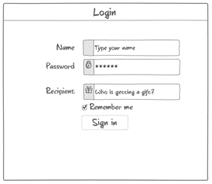
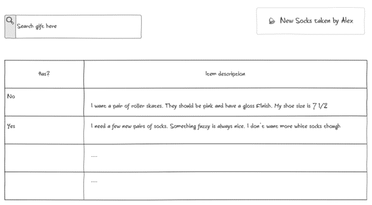

# startup
260 app

Include notes on startup ideas here

In a merge conflict, the first version of the file is the local copy, while the second version is the remote. The flow for resolving is pull, remove the header stuff, commit, push.


When planning gifts, it can be really tricky to get something the person wants without letting them know. It can also be hard to ensure they don’t get any duplicate gifts. Wishlist Wizard helps manage all of this easily. Users can view the wish list of a friend or search the list and notify other users once they pick out a gift in just a few taps. The recipient will never get another duplicate gift again, all the while not ruining the surprise.
Key features:
-	Secure login over https
-	Display a searchable wish-list
-	Notify gift givers when a gift is selected
-	Gift recipients don’t know what they’re going to get





# Simon
Here's a link to that [repo](https://github.com/haltosan/simon) and my [website](https://simon.notawebdev.click/)

Using windows is kinda tricky. The deploy scripts are bash, so it's big sad. Also, the pem they gave us doesn't like to work on windows because of odd permission errors. I still can't get it to work unless I'm using a custom ssh client. Oh well. I can do sftp from there to deploy everything manually, but it isn't the worst. I need a better dev environ right now. All I'm using is notepad++ and command prompt for git. VSCode may be the only way at this point.

Styling can be pretty hard. I was having trouble getting anything to show up properly. Turns out I was missing the main.css file completely and the only styling it could apply was from bootstrap. Bootstrap is also really nice and gives you a lot of nice features. It does take a while to learn what is available, and I expect I'll be learning for a while.

Javascript can be tricky. I had issues with local storage. When I was hosting the server off my local file system (just opening the html files in my browser), local storage wasn't being kept between each page. In deployment, it was remembering between pages. In the end, I figured out that the file system version didn't work as a continuous website (the browser has no way of knowing), but the deployed version was all under the same domain name.

# Cool stuff here on 

# CSS 


| Combinator       | Meaning                    | Example        | Description                                |
| ---------------- | -------------------------- | -------------- | ------------------------------------------ |
| Descendant       | A list of descendants      | `body section` | Any section that is a descendant of a body |
| Child            | A list of direct children  | `section > p`  | Any p that is a direct child of a section  |
| General sibling  | A list of siblings         | `p ~ div`      | Any p that has a div sibling               |
| Adjacent sibling | A list of adjacent sibling | `p + div`      | Any p that has an adjacent div sibling     |

class => . | .summary {} 

id => # | #name {}

attribute => [] | a[href] (has link), a[href='google.com'] (links to google)

| Property           | Value                              | Example             | Discussion                                                                     |
| ------------------ | ---------------------------------- | ------------------- | ------------------------------------------------------------------------------ |
| background-color   | color                              | `red`               | Fill the background color                                                      |
| border             | color width style                  | `#fad solid medium` | Sets the border using shorthand where any or all of the values may be provided |
| border-radius      | unit                               | `50%`               | The size of the border radius                                                  |
| box-shadow         | x-offset y-offset blu-radius color | `2px 2px 2px gray`  | Creates a shadow                                                               |
| columns            | number                             | `3`                 | Number of textual columns                                                      |
| column-rule        | color width style                  | `solid thin black`  | Sets the border used between columns using border shorthand                    |
| color              | color                              | `rgb(128, 0, 0)`    | Sets the text color                                                            |
| cursor             | type                               | `grab`              | Sets the cursor to display when hovering over the element                      |
| display            | type                               | `none`              | Defines how to display the element and its children                            |
| filter             | filter-function                    | `grayscale(30%)`    | Applies a visual filter                                                        |
| float              | direction                          | `right`             | Places the element to the left or right in the flow                            |
| flex               |                                    |                     | Flex layout. Used for responsive design                                        |
| font               | family size style                  | `Arial 1.2em bold`  | Defines the text font using shorthand                                          |
| grid               |                                    |                     | Grid layout. Used for responsive design                                        |
| height             | unit                               | `.25em`             | Sets the height of the box                                                     |
| margin             | unit                               | `5px 5px 0 0`       | Sets the margin spacing                                                        |
| max-[width/height] | unit                               | `20%`               | Restricts the width or height to no more than the unit                         |
| min-[width/height] | unit                               | `10vh`              | Restricts the width or height to no less than the unit                         |
| opacity            | number                             | `.9`                | Sets how opaque the element is                                                 |
| overflow           | [visible/hidden/scroll/auto]       | `scroll`            | Defines what happens when the content does not fix in its box                  |
| position           | [static/relative/absolute/sticky]  | `absolute`          | Defines how the element is positioned in the document                          |
| padding            | unit                               | `1em 2em`           | Sets the padding spacing                                                       |
| left               | unit                               | `10rem`             | The horizontal value of a positioned element                                   |
| text-align         | [start/end/center/justify]         | `end`               | Defines how the text is aligned in the element                                 |
| top                | unit                               | `50px`              | The vertical value of a positioned element                                     |
| transform          | transform-function                 | `rotate(0.5turn)`   | Applies a transformation to the element                                        |
| width              | unit                               | `25vmin`            | Sets the width of the box                                                      |
| z-index            | number                             | `100`               | Controls the positioning of the element on the z axis                          |


| Unit | Description                                                      |
| ---- | ---------------------------------------------------------------- |
| px   | The number of pixels                                             |
| pt   | The number of points (1/72 of an inch)                           |
| in   | The number of inches                                             |
| cm   | The number of centimeters                                        |
| %    | A percentage of the parent element                               |
| em   | A multiplier of the width of the letter `m` in the parent's font |
| rem  | A multiplier of the width of the letter `m` in the root's font   |
| ex   | A multiplier of the height of the element's font                 |
| vw   | A percentage of the viewport's width                             |
| vh   | A percentage of the viewport's height                            |
| vmin | A percentage of the viewport's smaller dimension                 |
| vmax | A percentage of the viewport's larger dimension                  |

```
@keyframes demo {
  from {
    font-size: 0vh;
  }

  95% {
    font-size: 21vh;
  }

  to {
    font-size: 20vh;
  }
}
```

```
.container {
  display: grid;
  grid-template-columns: repeat(auto-fill, minmax(300px, 1fr));
  grid-auto-rows: 300px;
  grid-gap: 1em;
}
```

```
body {
  display: flex;
  flex-direction: column;
  margin: 0;
  height: 100vh;
}
```

```
@media (orientation: portrait) {
  main {
    flex-direction: column;
  }
}

@media (max-height: 700px) {
  header {
    display: none;
  }
  footer {
    display: none;
  }
}
```

bootstrap
```
<meta name="viewport" content="width=device-width, initial-scale=1" />
    <link
      href="https://cdn.jsdelivr.net/npm/bootstrap@5.2.3/dist/css/bootstrap.min.css"
      rel="stylesheet"
      integrity="sha384-rbsA2VBKQhggwzxH7pPCaAqO46MgnOM80zW1RWuH61DGLwZJEdK2Kadq2F9CUG65"
      crossorigin="anonymous"
    />
```

regex
```
const objRegex = new RegExp('ab*', 'i');
const literalRegex = /ab*/i;
```

exception
```
function connectDatabase() {
  throw new Error('connection error');
}

try {
  connectDatabase();
  console.log('never executed');
} catch (err) {
  console.log(err);
} finally {
  console.log('always executed');
}
```

## DOM 
```
function insertChild(parentSelector, text) {
  const newChild = document.createElement('div');
  newChild.textContent = text;

  const parentElement = document.querySelector(parentSelector);
  parentElement.appendChild(newChild);
}

insertChild('#courses', 'new course');
```

```
function deleteChild(parentSelector) {
  const el = document.querySelector(parentSelector);
  el.parentElement.removeChild(el);
}

deleteChild('#courses div');
```

```
const el = document.querySelector('div');
el.innerHTML = '<div class="injected"><b>Hello</b>!</div>';
```

```
const submitDataEl = document.querySelector('#submitData');
submitDataEl.addEventListener('click', function (event) {
  console.log(event.type);
});
```

